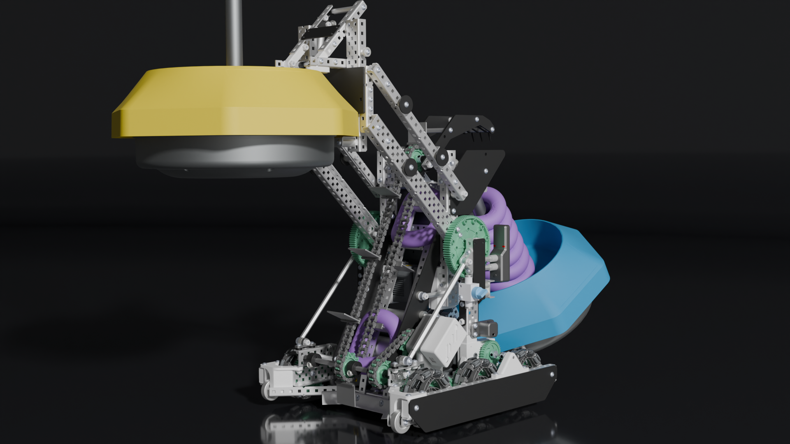

  

    
    

      
01 — Project

      <h3 class="card-title">Vex Robotics - Tipping Point</h3>
      
Led the design of a compact VEXU Tipping Point robot constrained to a 15" cube, incorporating a mobile goal intake and ring indexer within a minimal footprint using custom FDM-printed and Lexan components.

      

        Fusion360
        CAD
        Fabrication
      

    

    

  

  

    
    

      
02 — Project

      <h3 class="card-title">Vex Robotics - Spin Up</h3>
      
Led the design of a VEXU Spin Up robot built with 90% custom components, including custom-machined wheels, molded intake rollers, FDM-printed parts, and Lexan assemblies. The robot utilized a flywheel launcher and disc indexer for efficient goal scoring.

      

        OnShape
        Silicone Molding
        C++
      

    

    

  

  

    
    

      
03 — Project

      <h3 class="card-title">Thermal Eye</h3>
      
Designed a clip-on thermal imager for NFPA-compliant firefighter helmets that pinpoints hot zones, enabling hands-free heat detection without modification to existing safety equipment.

      

        Tolerancing
        FDM Printing
        Reverse Engineering
      

    

    

  

  

    
    

      
04 — Project

      <h3 class="card-title">In-Ear Activity Monitoring</h3>
      
Developed a proof-of-concept in-ear activity monitoring system using the built-in IMU of Apple AirPods, focusing on a user-friendly interface and the classification of 2-3 distinct exercises for phone-free step tracking.

      

        Embedded Systems
        Swift
        Figma
      

    

    

  

  

    
    

      
05 — Project

      <h3 class="card-title">Pneumatic Testing Apparatus</h3>
      
Developed a modular PLC program for an automated pneumatic component testing apparatus that digitized and implemented the company's existing testing procedures, integrating pressure and flow sensors for component validation.

      

        Automation
        PLC Programming
        Technical Communication
      

    

    

  

  

    
    

      
06 — Project

      <h3 class="card-title">SCD Table Redesign</h3>
      
Led the redesign of tables for a UIUC design space, applying human-centered design principles and lean manufacturing techniques to produce a scalable, user-focused solution for the environment.

      

        Human-Centered Design
        Lean Manufacturing
        Stakeholder Presentations
      

    

    

  

  

    
    

      
07 — Project

      <h3 class="card-title">Robotic Arm</h3>
      
Designed and hardware-tested a 3-DOF robotic arm simulation capable of picking up and transporting a coffee mug, with foundational work toward joint control and obstacle avoidance path planning.

      

        Fusion360
        Control Systems
        Soldering
      

    

    

  

